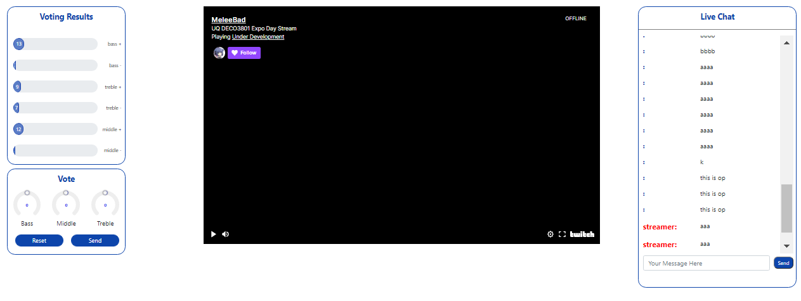

### Web page for the VSTreamers

The Studio 3 project of team 404NotFound 2 parts:

- The VST plugin that runs on the streamer's side
- The web page that exists on the audience's side.
- A database for storing chat messages , user credentials and vote results.

This repo is for the web page, which will have these features:

- Login and chat.
- Voting for changing the audio parameters (Bass, Middle and Treble).
- Viewing the voting results.
- View the stream (embedded Twitch stream).

### How to view

We host it on [glitch ](https://mellow-wiggly-ocelot.glitch.me/)

If you want to view it on localhost, follow these steps:
```
npm install
node app.js
```

After that, it can be accessed on localhost:3000. 
Note: this repo will have the defaultURL set to "`http://localhost:3000/`". For more detail, please see [client.js](https://github.com/BrainIs404/404NotFound/blob/master/js/client.js)

### Final product

The web page overview:



